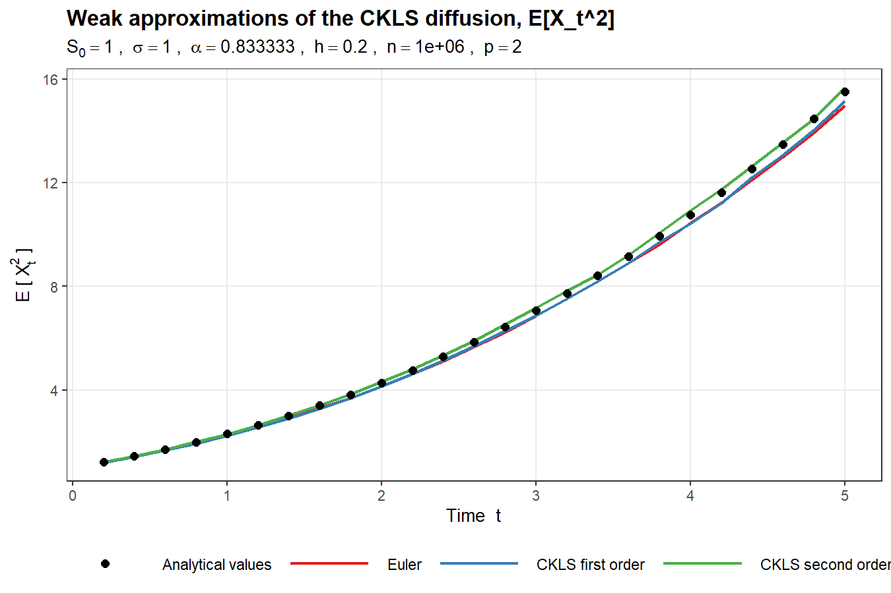

# Weak approximations of the CKLS model by discrete random variables

R code for my bachelor's thesis at Vilnius University (Finance and Actuarial Mathematics, 2026, graded 10/10).
Supervisor: Dr. Antanas Lenkšas.

The thesis constructs a second-order weak approximation of the CKLS short-rate model using discrete
random variables, and compares it against the Euler–Maruyama scheme and a first-order scheme by
checking how well each reproduces the exactly derived moments of the process.



## The model

The CKLS (Chan–Karolyi–Longstaff–Sanders) model is a one-factor short-rate model

    dX_t = (θ + k X_t) dt + σ X_t^α dB_t,      1/2 ≤ α < 1,

that contains the Vasicek (α = 0) and CIR (α = 1/2) models as special cases. It has no closed-form
solution for general α, so simulation relies on discretisation schemes.

## Method

The equation is split into a deterministic part, which is solved exactly, and the stochastic part

    dS_t = σ S_t^α dB_t,

which is approximated over a time step *h* by a **discrete random variable** whose first moments match
the moment expansion of *S_h* (split-step method, following Mackevičius and Alfonsi):

- **First-order scheme** - a two-point variable matching the first two moments.
- **Second-order scheme** - a three-point variable on {0, z₁, z₂} matching the first four moments up to
  O(h³). Two variants are used: one based on raw moments near zero, one based on central moments
  elsewhere, switched at the threshold *C·σ⁶·h³*.

Both are derived in the thesis for α = 5/6. Accuracy is measured against the exact moments
E[S_t^p] (p = 2, 3, 7), obtained from Itô's formula.

## Results

With a coarse step (h = 0.2) the second-order scheme tracks the analytical moments while Euler and
the first-order scheme fall increasingly below them; for the third moment at t = 5 Euler is roughly
30 % low and first-order 15 % low. With a fine step (h = 0.01) all three schemes converge and the
difference is within Monte Carlo noise. The practical gain of the higher-order scheme is therefore
that it allows a much larger step for the same accuracy.

| Figure | Setting |
|---|---|
| `figures/comparison_p2_h02.png`  | E[X_t²], h = 0.2, n = 10⁶ |
| `figures/comparison_p3_h02.png`  | E[X_t³], h = 0.2, n = 10⁶ |
| `figures/comparison_p2_h001.png` | E[X_t²], h = 0.01, n = 10⁶ (all schemes coincide) |

Runtime for 10⁶ trajectories at h = 0.01: Euler ≈ 2 min, first order ≈ 5 min, second order ≈ 23 min
(single core). The second-order scheme is about 10× slower per step than Euler, which is more than
offset by the coarser step it permits.

## Running the code

Requires R (≥ 4.0) and `ggplot2`.

```r
install.packages("ggplot2")
source("ckls_weak_approximation.R")
```

Parameters are set at the top of the script:

| Parameter | Meaning | Default |
|---|---|---|
| `moment_order` | *p* in E[X_t^p]; analytical coefficients available for 2, 3, 7 | 2 |
| `h` | time step | 0.01 |
| `n_paths` | number of Monte Carlo trajectories | 1 000 000 |
| `sigma`, `S0`, `T_max` | volatility, initial value, horizon | 1, 1, 5 |

The script prints a table of estimated vs. analytical moments, the RMSE of each scheme, and saves a
figure to `figures/`. For a quick test set `n_paths <- 1e4` (runs in seconds).

## Files

- `ckls_weak_approximation.R` - analytical moments, discrete samplers, the three schemes, simulation and plot
- `figures/` - output plots

## References

- Chan, Karolyi, Longstaff, Sanders (1992). *An Empirical Comparison of Alternative Models of the Short-Term Interest Rate.* J. Finance 47.
- Mackevičius, V. (2011). *Weak approximation of CIR equation by discrete random variables.* Lith. Math. J. 51(3).
- Alfonsi, A. (2005). *On the discretization schemes for the CIR (and Bessel squared) processes.* Monte Carlo Methods Appl. 11(4).
- Lileika, G. (2021). *Weak approximations of CKLS model by discrete random variables.* PhD thesis, Vilnius University.
